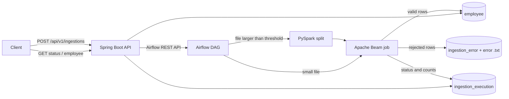

# Lumi Ingestion Platform

A data ingestion platform that loads employee **CSV** and **JSON** files into a PostgreSQL data warehouse.
A REST API receives the request, **Apache Airflow** orchestrates the run, **PySpark** splits large files,
and an **Apache Beam** pipeline validates, cleans, encrypts and loads every record.

Built as the Amex Lumi readiness case study (Phases 1–3), in a local setup that mirrors a GCP stack
(Composer, Dataproc, Dataflow, BigQuery).

---

## Table of contents

- [Features](#features)
- [Architecture](#architecture)
- [Tech stack](#tech-stack)
- [Project structure](#project-structure)
- [Prerequisites](#prerequisites)
- [Setup](#setup)
- [Running an ingestion](#running-an-ingestion)
- [API reference](#api-reference)
- [Configuration](#configuration)
- [Data model](#data-model)
- [Testing](#testing)
- [Troubleshooting](#troubleshooting)
- [Stopping and resetting](#stopping-and-resetting)
- [Further reading](#further-reading)

---

## Features

| Area | What it does |
|---|---|
| **Ingestion API** | Validates the data file and control file, creates a unique execution ID, triggers Airflow and returns `202 Accepted` |
| **File formats** | CSV (with header) and JSON (array or one object per line) |
| **Large files** | Files above a configurable size are split by PySpark and processed in parallel |
| **Validation** | Field rules per column (required, min/max length, email, date, currency, boolean) with every error reported per record |
| **Data cleansing** | Missing text values are replaced with whitespace |
| **Metadata** | Every row gets `execution_id`, `ingestion_timestamp` and `source_creation_time` |
| **Security** | Phone, salary and emergency phone are encrypted with AES-256-GCM; error records store them redacted |
| **Partial success** | Bad records go to an error file and table; good records still load |
| **Record count check** | Loaded rows are compared with the control file's `record_count`; a mismatch fails the run with a clear reason |
| **Decryption API** | Returns an employee with sensitive fields decrypted |
| **Observability** | Run status table, per-step logs tagged with the execution ID, Beam counters summary |

---

## Architecture



**Flow of one ingestion**

1. The client calls the API with a data file, a control file and the file type.
2. The API checks both files, creates the execution ID and triggers the Airflow DAG with the run details.
3. Airflow validates the parameters and, if the file is large, runs the PySpark split job.
4. Airflow runs the Beam job, which reads → validates → fills missing values → adds metadata → encrypts → loads.
5. Beam compares the loaded count with the control file and saves `SUCCESS` or `FAILED`.
6. Airflow checks the final status. The client reads it with `GET /api/v1/ingestions/{executionId}`.

| Component | Runs on |
|---|---|
| Spring Boot API | Host machine (port `8080`) |
| PostgreSQL | Docker (port `5432`, configurable) |
| Airflow webserver and scheduler | Docker (port `8082`) |
| PySpark and Beam jobs | Inside the Airflow scheduler container |

---

## Tech stack

| Layer | Technology |
|---|---|
| API | Java 17, Spring Boot 4, Spring JDBC, Bean Validation |
| Orchestration | Apache Airflow 2.9 (LocalExecutor) |
| Processing | Apache Beam 2.76 (DirectRunner), PySpark 3.5 |
| Storage | PostgreSQL 13 (warehouse + Airflow metadata) |
| Security | AES-256-GCM field encryption |
| Build and run | Maven Wrapper, Docker Compose |
| Tests | JUnit 5, Mockito, Beam PAssert, Spring MockMvc, Python unittest |

---

## Project structure

```
.
├── springboot-ingestion-service/   REST API (controller → service → repository / Airflow client)
├── beam-ingestion/                 Beam pipeline (read, validate, transform, write, execution)
├── airflow/
│   ├── dags/                       DAG definition + task functions (lumi_ingestion/)
│   ├── scripts/                    Bash scripts that start PySpark and Beam
│   └── tests/                      DAG tests
├── pyspark/
│   ├── jobs/split_file.py          Large-file splitter
│   └── tests/                      Split job tests
├── database/init/                  Warehouse tables, created on first start
├── data/samples/                   Sample CSV and JSON files
├── control-files/                  Sample control files (record_count)
├── docs/INTERVIEW_GUIDE.md         Detailed walkthrough of the design
├── docker-compose.yml
└── .env.example                    Template for local settings
```

---

## Prerequisites

| Tool | Version | Check |
|---|---|---|
| Docker Desktop (or Docker Engine + Compose plugin) | Recent | `docker compose version` |
| Java JDK | 17 or newer | `java -version` |
| Git | Any | `git --version` |

Maven does **not** need to be installed: both Java modules include the Maven Wrapper (`mvnw` / `mvnw.cmd`).
The first build downloads dependencies and Docker images, so an internet connection is needed once.

---

## Setup

All commands run from the repository root unless stated otherwise.

### 1. Clone the repository

```bash
git clone https://github.com/gourshabrg/final.git
cd final
```

### 2. Create the local settings file

macOS / Linux:
```bash
cp .env.example .env
```

Windows (PowerShell):
```powershell
Copy-Item .env.example .env
```

Open `.env` and set `LUMI_ENCRYPTION_KEY` to a value of **exactly 32 characters**.
The same key is used to encrypt (Beam) and decrypt (API). `.env` is ignored by Git; never commit it.

> If PostgreSQL is already installed on your machine and uses port 5432, also uncomment
> `POSTGRES_HOST_PORT=5433` and `LUMI_WAREHOUSE_JDBC_URL` in `.env`.

### 3. Build the Beam job

Airflow runs the Beam job from `beam-ingestion/target/beam-ingestion-1.0.0-SNAPSHOT.jar`.

macOS / Linux:
```bash
cd beam-ingestion
./mvnw clean package -DskipTests
cd ..
```

Windows (PowerShell):
```powershell
Set-Location beam-ingestion
.\mvnw.cmd clean package -DskipTests
Set-Location ..
```

### 4. Start PostgreSQL and Airflow

```bash
docker compose up -d --build
```

The first start takes a few minutes (it builds the Airflow image with Java and PySpark).
Check that everything is up:

```bash
docker compose ps
```

`lumi-postgres` should be `healthy`, and the Airflow webserver and scheduler `Up`.
Airflow UI: <http://localhost:8082> (user `airflow`, password `airflow`).

### 5. Start the API

Start it from the module folder, so the default paths `../data` and `../control-files` point to the right place.

macOS / Linux:
```bash
cd springboot-ingestion-service
./mvnw spring-boot:run
```

Windows (PowerShell):
```powershell
Set-Location springboot-ingestion-service
.\mvnw.cmd spring-boot:run
```

Check it is running: <http://localhost:8080/actuator/health> returns `{"status":"UP"}`.

---

## Running an ingestion

`fileLocation` is relative to `data/` and `controlFileLocation` is relative to `control-files/`.
Absolute paths inside those folders also work.

macOS / Linux:
```bash
curl -X POST http://localhost:8080/api/v1/ingestions \
  -H "Content-Type: application/json" \
  -d '{"fileLocation":"samples/employees.csv","controlFileLocation":"employees_csv.properties","fileType":"CSV"}'
```

Windows (PowerShell):
```powershell
$body = @{
  fileLocation        = "samples/employees.csv"
  controlFileLocation = "employees_csv.properties"
  fileType            = "CSV"
} | ConvertTo-Json

Invoke-RestMethod -Uri http://localhost:8080/api/v1/ingestions -Method Post `
  -ContentType "application/json" -Body $body
```

Response (`202 Accepted`):
```json
{
  "executionId": "673bea1b-3f9e-4709-9776-877492fa375d",
  "dagRunId": "ingestion_673bea1b-3f9e-4709-9776-877492fa375d",
  "requiresSplit": true,
  "status": "ACCEPTED",
  "message": "Ingestion started in Airflow. Check GET /api/v1/ingestions/673bea1b-... for the result."
}
```

Follow the run in the Airflow UI, then check the result:

```bash
curl http://localhost:8080/api/v1/ingestions/<executionId>
```

### Sample files

| Data file | Control file | Expected result |
|---|---|---|
| `samples/employees.csv` | `employees_csv.properties` | `SUCCESS`, 20 of 20 loaded |
| `samples/employees.json` | `employees_json.properties` | `SUCCESS`, 20 of 20 loaded |
| `samples/employees_with_errors.csv` | `employees_with_errors.properties` | `FAILED`, 16 loaded, 4 errors, record count mismatch |

Rejected records are written to `data/error/execution-<executionId>.txt` and to the `ingestion_error` table.

### Using your own file

1. Put the data file in `data/` (e.g. `data/input/my_file.csv`).
2. Create a control file in `control-files/` with one line: `record_count=<number of records>`.
3. Call the API with `fileLocation: "input/my_file.csv"`, your control file name and `fileType` `CSV` or `JSON`.

CSV files need a header row with these columns (order does not matter):

```
employee_id,first_name,last_name,email,phone_number,hire_date,department,job_title,salary,currency,
employment_status,manager_id,is_active,skills,address_street,address_city,address_state,
address_postal_code,address_country,emergency_contact_name,emergency_contact_relationship,
emergency_contact_phone,emergency_contact_email
```

`skills` are separated by `;`. JSON files use the same field names, with `skills` as a list and
`address` / `emergency_contact` as nested objects (see `data/samples/employees.json`).

---

## API reference

Base URL: `http://localhost:8080`

| Method | Path | Description | Success |
|---|---|---|---|
| `POST` | `/api/v1/ingestions` | Start an ingestion | `202` |
| `GET` | `/api/v1/ingestions/{executionId}` | Status, expected vs loaded count, error count, failure reason | `200` |
| `GET` | `/api/v1/employees/{employeeId}` | Employee with phone, salary and emergency phone decrypted | `200` |
| `POST` | `/api/v1/decrypt` | Decrypt one value copied from the database: `{"encryptedValue":"v1:..."}` | `200` |
| `GET` | `/actuator/health` | Health check | `200` |

All errors return the same JSON shape:

```json
{
  "timestamp": "2026-09-22T20:11:18.37Z",
  "status": 400,
  "error": "Bad Request",
  "message": "Data file does not exist: .../data/samples/nope.csv",
  "path": "/api/v1/ingestions"
}
```

| Status | Meaning |
|---|---|
| `400` | Invalid body, missing or empty file, bad control file, path outside the allowed folders, value that cannot be decrypted |
| `404` | Unknown execution ID or employee |
| `502` | Airflow is not reachable or rejected the run |
| `500` | Unexpected error (details only in the server log) |

> The decryption endpoints return sensitive data. They are open for local use only; in a real deployment
> they must be protected with authentication and roles.

---

## Configuration

API settings are in `springboot-ingestion-service/src/main/resources/application.yml` and can be
overridden with environment variables or `.env`.

| Setting | Environment variable | Default |
|---|---|---|
| Encryption key (32 characters) | `LUMI_ENCRYPTION_KEY` | none, required |
| Split threshold in bytes | `LUMI_FILE_SIZE_THRESHOLD_BYTES` | `1` (every file is split) |
| Records per split file | `LUMI_RECORDS_PER_SPLIT_FILE` (Airflow) | `50` |
| Local data folder | `LUMI_LOCAL_DATA_ROOT` | `../data` |
| Local control-file folder | `LUMI_LOCAL_CONTROL_FILE_ROOT` | `../control-files` |
| Warehouse JDBC URL | `LUMI_WAREHOUSE_JDBC_URL` | `jdbc:postgresql://localhost:5432/warehouse` |
| PostgreSQL port on the host | `POSTGRES_HOST_PORT` | `5432` |
| Airflow URL | `AIRFLOW_BASE_URL` | `http://localhost:8082` |

### Validation rules

| Field | Rule |
|---|---|
| `employee_id`, `manager_id` | Required, exactly 7 characters |
| `first_name` | Required, 3–15 characters |
| `last_name` | Optional, up to 15 characters |
| `email` | Required, 13–30 characters, valid format |
| `phone_number` | Required, exactly 10 characters |
| `hire_date` | Required, valid date `yyyy-MM-dd` |
| `department` / `job_title` | Optional, up to 20 / 30 characters |
| `currency` | Required, 3 uppercase letters (e.g. `INR`) |
| `employment_status` | Required, 3–13 characters |
| `is_active` | Required, `true` or `false` |
| `skills` | Up to 100 characters in total |
| `salary` | Whole number, not negative |

---

## Data model

The warehouse database is `warehouse` (created by `database/init`).

| Table | One row per | Main columns |
|---|---|---|
| `employee` | Employee | Employee fields, `phone_number_encrypted`, `salary_encrypted`, JSONB `skills` / `address` / `emergency_contact`, `ingestion_timestamp`, `execution_id`, `source_creation_time` |
| `ingestion_error` | Rejected record | `execution_id`, `record_number`, `error_type` (`PARSE_ERROR`, `VALIDATION_ERROR`, `LOAD_ERROR`), `error_message`, redacted `raw_record` |
| `ingestion_execution` | Run | `status` (`STARTED`, `RUNNING`, `SUCCESS`, `FAILED`), expected and loaded counts, timings, `failure_reason` |

Connect with any PostgreSQL client on `localhost:<POSTGRES_HOST_PORT>`, database `warehouse`,
user `airflow`, password `airflow`, or:

```bash
docker exec -it lumi-postgres psql -U airflow -d warehouse
```

---

## Testing

153 automated tests. Database tests use the Docker warehouse and are **skipped** (not failed) when it is not running.

| Module | Tests | Command |
|---|---|---|
| Beam | 78 (7 against the database) | `cd beam-ingestion && ./mvnw test` |
| Spring Boot | 52 (4 against the database) | `cd springboot-ingestion-service && ./mvnw test` |
| Airflow DAG | 15 | `docker exec lumi-airflow-scheduler python -m unittest discover -s /opt/airflow/tests -v` |
| PySpark | 8 | `docker exec lumi-airflow-scheduler python -m unittest discover -s /opt/lumi/pyspark/tests -v` |

On Windows use `.\mvnw.cmd test`. In Git Bash, prefix the `docker exec` commands with `MSYS_NO_PATHCONV=1`.

---

## Troubleshooting

| Problem | Cause | Fix |
|---|---|---|
| API health is `DOWN`, log says `password authentication failed for user "airflow"` | Another PostgreSQL on your machine uses port 5432 | Set `POSTGRES_HOST_PORT=5433` and `LUMI_WAREHOUSE_JDBC_URL=jdbc:postgresql://localhost:5433/warehouse` in `.env`, then `docker compose up -d` |
| `invalid value for parameter "TimeZone"` | Old time-zone name on the machine (e.g. `Asia/Calcutta`) | The app and tests already force UTC; when running Java yourself add `-Duser.timezone=UTC` |
| API returns `502` | Airflow is not running or still starting | `docker compose ps`, wait for the webserver, check <http://localhost:8082> |
| Airflow task `run_beam_pipeline` fails with "JAR not found" | Beam job not built | Run step 3 of [Setup](#setup) |
| `Data file does not exist` although the file is there | API started from another folder | Start it from `springboot-ingestion-service`, or set `LUMI_LOCAL_DATA_ROOT` / `LUMI_LOCAL_CONTROL_FILE_ROOT` |
| API fails at start with "lumi.encryption.key must be exactly 32 bytes" | Wrong key length in `.env` | Use exactly 32 characters |
| `docker compose` says `Set LUMI_ENCRYPTION_KEY in .env` | `.env` missing | Do step 2 of [Setup](#setup) |

Useful logs:

```bash
docker compose logs -f airflow-scheduler      # Airflow, PySpark and Beam output
docker compose logs -f airflow-webserver
```

Every log line of a run contains its `execution_id`, so one search finds the whole run.

---

## Stopping and resetting

```bash
docker compose down        # stop the containers, keep the data
docker compose down -v     # stop and delete the database (tables are recreated on the next start)
```

Stop the API with `Ctrl+C` in its terminal.

---

## Further reading

[docs/INTERVIEW_GUIDE.md](docs/INTERVIEW_GUIDE.md) explains the design step by step: why each technology is
used, a walkthrough of the main classes, the requirement-to-code mapping and common interview questions.
