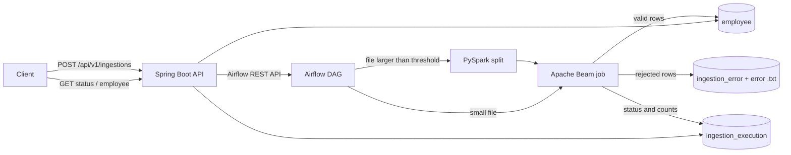

# Lumi Ingestion Platform

A data ingestion platform that loads employee **CSV** and **JSON** files into a PostgreSQL data warehouse.
A REST API receives the request, **Apache Airflow** orchestrates the run, **PySpark** splits large files,
and an **Apache Beam** pipeline validates, cleans, encrypts and loads every record.

Built as the Amex Lumi readiness case study (Phases 1–3), in a local setup that mirrors a GCP stack
(Composer, Dataproc, Dataflow, BigQuery).

---

## Table of contents

- [Features](#features)
- [Architecture](#architecture)
- [Tech stack](#tech-stack)
- [Project structure](#project-structure)
- [Prerequisites](#prerequisites)
- [Setup](#setup)
- [Running an ingestion](#running-an-ingestion)
- [API reference](#api-reference)
- [Configuration](#configuration)
- [Data model](#data-model)
- [Testing](#testing)
- [Troubleshooting](#troubleshooting)
- [Stopping and resetting](#stopping-and-resetting)
- [Further reading](#further-reading)

---

## Features

| Area | What it does |
|---|---|
| **Ingestion API** | Validates the data file and control file, creates a unique execution ID, triggers Airflow and returns `202 Accepted` |
| **File formats** | CSV (with header) and JSON (array or one object per line) |
| **Large files** | Files above a configurable size are split by PySpark and processed in parallel |
| **Validation** | Field rules per column (required, min/max length, email, date, currency, boolean) with every error reported per record |
| **Data cleansing** | Missing text values are replaced with whitespace |
| **Metadata** | Every row gets `execution_id`, `ingestion_timestamp` and `source_creation_time` |
| **Security** | Phone, salary and emergency phone are encrypted with AES-256-GCM; error records store them redacted |
| **Partial success** | Bad records go to an error file and table; good records still load |
| **Duplicates and stale data** | A repeated `employee_id` in one file is rejected (the first one loads); an older file never overwrites newer data |
| **Record count check** | Loaded rows are compared with the control file's `record_count`; a mismatch fails the run with a clear reason |
| **Decryption API** | Returns an employee with sensitive fields decrypted |
| **Observability** | Run status table, per-step logs tagged with the execution ID, Beam counters summary |

---

## Architecture


```mermaid
flowchart LR
    Client -->|POST /api/v1/ingestions| API[Spring Boot API]
    API -->|Airflow REST API| DAG[Airflow DAG]
    DAG -->|file larger than threshold| Spark[PySpark split]
    Spark --> Beam[Apache Beam job]
    DAG -->|small file| Beam
    Beam -->|valid rows| WH[(employee)]
    Beam -->|rejected rows| ERR[(ingestion_error + error .txt)]
    Beam -->|status and counts| EX[(ingestion_execution)]
    Client -->|GET status / employee| API
    API --> WH
    API --> EX
```

**Flow of one ingestion**

1. The client calls the API with a data file, a control file and the file type.
2. The API checks both files, creates the execution ID and triggers the Airflow DAG with the run details.
3. Airflow validates the parameters and, if the file is large, runs the PySpark split job.
4. Airflow runs the Beam job, which reads → validates → fills missing values → adds metadata → encrypts → loads.
5. Beam compares the loaded count with the control file and saves `SUCCESS` or `FAILED`.
6. Airflow checks the final status. The client reads it with `GET /api/v1/ingestions/{executionId}`.

| Component | Runs on |
|---|---|
| Spring Boot API | Host machine (port `8080`) |
| PostgreSQL | Docker (port `5432`, configurable) |
| Airflow webserver and scheduler | Docker (port `8082`) |
| PySpark and Beam jobs | Inside the Airflow scheduler container |

---

## Tech stack

| Layer | Technology |
|---|---|
| API | Java 17, Spring Boot 4, Spring JDBC, Bean Validation |
| Orchestration | Apache Airflow 2.9 (LocalExecutor) |
| Processing | Apache Beam 2.76 (DirectRunner), PySpark 3.5 |
| Storage | PostgreSQL 13 (warehouse + Airflow metadata) |
| Security | AES-256-GCM field encryption |
| Build and run | Maven Wrapper, Docker Compose |
| Tests | JUnit 5, Mockito, Beam PAssert, Spring MockMvc, Python unittest, JaCoCo, Checkstyle, Ruff |

> **Two Jackson versions on purpose.** Beam is built on Jackson 2 (`com.fasterxml.jackson`), and Spring Boot 4
> uses Jackson 3 (`tools.jackson`). They live in separate Maven modules, so each keeps the version its framework
> needs, and the two never meet on one classpath.

---

## Project structure

```
.
├── springboot-ingestion-service/   REST API (controller → service → repository / Airflow client)
├── beam-ingestion/                 Beam pipeline (read, validate, transform, write, execution)
├── airflow/
│   ├── dags/                       DAG definition + task functions (lumi_ingestion/)
│   ├── scripts/                    Bash scripts that start PySpark and Beam
│   └── tests/                      DAG tests
├── pyspark/
│   ├── jobs/split_file.py          Large-file splitter
│   └── tests/                      Split job tests
├── database/init/                  Warehouse tables, created on first start
├── data/samples/                   Sample CSV and JSON files
├── control-files/                  Sample control files (record_count)
├── contracts/lumi-contract.json    Values all four modules must agree on (checked by each module's tests)
├── config/checkstyle/              Java style rules for both Maven modules
├── tests/e2e/run_scenarios.py      End-to-end scenario suite (whole platform)
├── docs/INTERVIEW_GUIDE.md         Detailed walkthrough of the design
├── docker-compose.yml
├── ruff.toml                       Python lint rules
└── .env.example                    Template for local settings
```

---

## Prerequisites

| Tool | Version | Check |
|---|---|---|
| Docker Desktop (or Docker Engine + Compose plugin) | Recent | `docker compose version` |
| Java JDK | 17 or newer | `java -version` |
| Git | Any | `git --version` |

Maven does **not** need to be installed: both Java modules include the Maven Wrapper (`mvnw` / `mvnw.cmd`).
The first build downloads dependencies and Docker images, so an internet connection is needed once.

---

## Setup

All commands run from the repository root unless stated otherwise.

### 1. Clone the repository

```bash
git clone https://github.com/gourshabrg/final.git
cd final
```

### 2. Create the local settings file

macOS / Linux:
```bash
cp .env.example .env
```

Windows (PowerShell):
```powershell
Copy-Item .env.example .env
```

Open `.env` and set `LUMI_ENCRYPTION_KEY`. Best is a random key: `openssl rand -base64 32` (44 characters).
Exactly 32 typed characters also work, but the job logs a warning. The same key is used to encrypt (Beam) and
decrypt (API). `.env` is ignored by Git; never commit it.

The database and Airflow logins default to `airflow` / `airflow`. To change them, set `POSTGRES_USER`,
`POSTGRES_PASSWORD`, `AIRFLOW_ADMIN_USERNAME` and `AIRFLOW_ADMIN_PASSWORD` in `.env` **before the first start**
(PostgreSQL applies them only when its volume is created).

> If PostgreSQL is already installed on your machine and uses port 5432, also uncomment
> `POSTGRES_HOST_PORT=5433` and `LUMI_WAREHOUSE_JDBC_URL` in `.env`.

### 3. Build the Beam job

Airflow runs the Beam job from `beam-ingestion/target/beam-ingestion-1.0.0-SNAPSHOT.jar`.

macOS / Linux:
```bash
cd beam-ingestion
./mvnw clean package -DskipTests
cd ..
```

Windows (PowerShell):
```powershell
Set-Location beam-ingestion
.\mvnw.cmd clean package -DskipTests
Set-Location ..
```

### 4. Start PostgreSQL and Airflow

```bash
docker compose up -d --build
```

The first start takes a few minutes (it builds the Airflow image with Java and PySpark).
Check that everything is up:

```bash
docker compose ps
```

`lumi-postgres` should be `healthy`, and the Airflow webserver and scheduler `Up`.
Airflow UI: <http://localhost:8082> (default user `airflow`, password `airflow`).
All ports are bound to `127.0.0.1`, so they are reachable only from your own machine.

### 5. Start the API

Start it from the module folder, so the default paths `../data` and `../control-files` point to the right place.

macOS / Linux:
```bash
cd springboot-ingestion-service
./mvnw spring-boot:run
```

Windows (PowerShell):
```powershell
Set-Location springboot-ingestion-service
.\mvnw.cmd spring-boot:run
```

Check it is running: <http://localhost:8080/actuator/health> returns `{"status":"UP"}`.

---

## Running an ingestion

`fileLocation` is relative to `data/` and `controlFileLocation` is relative to `control-files/`.
Absolute paths inside those folders also work.

macOS / Linux:
```bash
curl -X POST http://localhost:8080/api/v1/ingestions \
  -H "Content-Type: application/json" \
  -d '{"fileLocation":"samples/employees.csv","controlFileLocation":"employees_csv.properties","fileType":"CSV"}'
```

Windows (PowerShell):
```powershell
$body = @{
  fileLocation        = "samples/employees.csv"
  controlFileLocation = "employees_csv.properties"
  fileType            = "CSV"
} | ConvertTo-Json

Invoke-RestMethod -Uri http://localhost:8080/api/v1/ingestions -Method Post `
  -ContentType "application/json" -Body $body
```

Response (`202 Accepted`):
```json
{
  "executionId": "673bea1b-3f9e-4709-9776-877492fa375d",
  "dagRunId": "ingestion_673bea1b-3f9e-4709-9776-877492fa375d",
  "requiresSplit": true,
  "status": "ACCEPTED",
  "message": "Ingestion started in Airflow. Check GET /api/v1/ingestions/673bea1b-... for the result."
}
```

Follow the run in the Airflow UI, then check the result:

```bash
curl http://localhost:8080/api/v1/ingestions/<executionId>
```

### Sample files

| Data file | Control file | Expected result |
|---|---|---|
| `samples/employees.csv` | `employees_csv.properties` | `SUCCESS`, 20 of 20 loaded |
| `samples/employees.json` | `employees_json.properties` | `SUCCESS`, 20 of 20 loaded |
| `samples/employees_with_errors.csv` | `employees_with_errors.properties` | `FAILED`, 16 loaded, 4 errors, record count mismatch |
| `samples/employees_large.csv` | `employees_large_csv.properties` | `SUCCESS`, 120 of 120 loaded (split into 3 files) |
| `samples/employees_large.json` | `employees_large_json.properties` | `SUCCESS`, 120 of 120 loaded (split into 3 files) |

Rejected records are written to `data/error/execution-<executionId>.txt` and to the `ingestion_error` table.

### Using your own file

1. Put the data file in `data/` (e.g. `data/input/my_file.csv`).
2. Create a control file in `control-files/` with one line: `record_count=<number of records>`.
3. Call the API with `fileLocation: "input/my_file.csv"`, your control file name and `fileType` `CSV` or `JSON`.

CSV files need a header row with these columns (order does not matter):

```
employee_id,first_name,last_name,email,phone_number,hire_date,department,job_title,salary,currency,
employment_status,manager_id,is_active,skills,address_street,address_city,address_state,
address_postal_code,address_country,emergency_contact_name,emergency_contact_relationship,
emergency_contact_phone,emergency_contact_email
```

If a required column (`employee_id`, `first_name`, `email`, `phone_number`, `hire_date`, `currency`,
`employment_status`, `manager_id`, `is_active`) is missing from the header, the whole file is rejected with one
clear error. Unknown columns are ignored with a warning in the log.

`skills` are separated by `;`. JSON files use the same field names, with `skills` as a list and
`address` / `emergency_contact` as nested objects (see `data/samples/employees.json`).

---

## API reference

Base URL: `http://localhost:8080`

| Method | Path | Description | Success |
|---|---|---|---|
| `POST` | `/api/v1/ingestions` | Start an ingestion | `202` |
| `GET` | `/api/v1/ingestions/{executionId}` | Status, expected vs loaded count, error count, failure reason | `200` |
| `GET` | `/api/v1/employees/{employeeId}` | Employee with phone, salary and emergency phone decrypted | `200` |
| `POST` | `/api/v1/decrypt` | Decrypt one value copied from the database: `{"encryptedValue":"v1:..."}` | `200` |
| `GET` | `/actuator/health` | Health check | `200` |

All errors return the same JSON shape:

```json
{
  "timestamp": "2026-09-22T20:11:18.37Z",
  "status": 400,
  "error": "Bad Request",
  "code": "INVALID_REQUEST",
  "message": "Data file does not exist: samples/nope.csv",
  "path": "/api/v1/ingestions"
}
```

`code` is stable, so a client can check it instead of parsing `message`.

| Status | `code` | Meaning |
|---|---|---|
| `400` | `INVALID_REQUEST` | Missing or empty file, bad control file, path outside the allowed folders |
| `400` | `VALIDATION_FAILED` / `MALFORMED_BODY` / `INVALID_PATH_VALUE` | Missing body field, unreadable JSON body, bad UUID in the URL |
| `400` | `DECRYPTION_FAILED` | Value that cannot be decrypted |
| `404` | `NOT_FOUND` / `ENDPOINT_NOT_FOUND` | Unknown execution ID or employee / unknown URL |
| `405` | `METHOD_NOT_ALLOWED` | Wrong HTTP method, e.g. `GET /api/v1/decrypt` |
| `415` | `UNSUPPORTED_MEDIA_TYPE` | Body is not `application/json` |
| `502` | `AIRFLOW_UNAVAILABLE` | Airflow is not reachable or rejected the run |
| `500` | `SERVER_DATA_ERROR` / `INTERNAL_ERROR` | Stored data cannot be read, or an unexpected error (details only in the server log) |

> The decryption endpoints return sensitive data. They are open for local use only; in a real deployment
> they must be protected with authentication and roles.

---

## Configuration

API settings are in `springboot-ingestion-service/src/main/resources/application.yml` and can be
overridden with environment variables or `.env`.

| Setting | Environment variable | Default |
|---|---|---|
| Encryption key (32 bytes in base64, or 32 characters) | `LUMI_ENCRYPTION_KEY` | none, required |
| Database user / password | `POSTGRES_USER` / `POSTGRES_PASSWORD` | `airflow` / `airflow` |
| Airflow user / password | `AIRFLOW_ADMIN_USERNAME` / `AIRFLOW_ADMIN_PASSWORD` | `airflow` / `airflow` |
| Split threshold in bytes | `LUMI_FILE_SIZE_THRESHOLD_BYTES` | `100` (all sample files are split) |
| Records per split file | `LUMI_RECORDS_PER_SPLIT_FILE` (Airflow) | `50` |
| Local data folder | `LUMI_LOCAL_DATA_ROOT` | `../data` |
| Local control-file folder | `LUMI_LOCAL_CONTROL_FILE_ROOT` | `../control-files` |
| Warehouse JDBC URL | `LUMI_WAREHOUSE_JDBC_URL` | `jdbc:postgresql://localhost:5432/warehouse` |
| PostgreSQL port on the host | `POSTGRES_HOST_PORT` | `5432` |
| Airflow URL | `AIRFLOW_BASE_URL` | `http://localhost:8082` |

### Validation rules

| Field | Rule |
|---|---|
| `employee_id`, `manager_id` | Required, exactly 7 letters or digits |
| `first_name` | Required, 3–15 characters |
| `last_name` | Optional, up to 15 characters |
| `email` | Required, 13–30 characters, valid format, unique in the warehouse |
| `phone_number` | Required, exactly 10 digits |
| `hire_date` | Required, valid date `yyyy-MM-dd`, not in the future |
| `department` / `job_title` | Optional, up to 20 / 30 characters |
| `currency` | Required, a real ISO 4217 code (e.g. `INR`, `USD`) |
| `employment_status` | Required, one of `Contract`, `Full-time`, `Intern`, `Part-time`, `Temporary` |
| `is_active` | Required, `true` or `false` (JSON: a real boolean, not `"true"` or `1`) |
| `skills` | Up to 100 characters in total |
| `salary` | Whole number, not negative (JSON: `950000`, not `950000.5` or `"950000"`) |

The same `employee_id` twice in one file: the first one (lowest record number) loads, the others are rejected
as `DUPLICATE_ERROR`.

---

## Data model

The warehouse database is `warehouse` (created by `database/init`).

| Table | One row per | Main columns |
|---|---|---|
| `employee` | Employee | Employee fields (unique `email`), `phone_number_encrypted`, `salary_encrypted`, JSONB `skills` / `address` / `emergency_contact`, `ingestion_timestamp`, `execution_id`, `source_creation_time`, `source_modified_at` |
| `ingestion_error` | Rejected record | `execution_id`, `source_file`, `split_file`, `record_number` (`0` = the whole file), `error_type`, `error_message`, redacted `raw_record` |
| `ingestion_execution` | Run | `status` (`STARTED`, `RUNNING`, `SUCCESS`, `FAILED`), expected and loaded counts, timings, `failure_reason` |

| `error_type` | Meaning |
|---|---|
| `PARSE_ERROR` | Row or file cannot be read (broken CSV row, invalid JSON, wrong JSON type, missing CSV header column) |
| `VALIDATION_ERROR` | Row read fine but breaks a [validation rule](#validation-rules) |
| `DUPLICATE_ERROR` | Same `employee_id` appeared earlier in the same file |
| `LOAD_ERROR` | Database refused the row (e.g. email already used by another employee) |
| `STALE_ERROR` | The warehouse already has this employee from a **newer** file, so the older record is skipped |

Stale protection: every row stores `source_modified_at` (the source file's last-modified time). The upsert only
updates a row when the incoming file is the same age or newer, so re-running an old file cannot undo newer data.

### Finding a rejected record

Each rejected record is one line in `data/error/execution-<id>.txt` and one row in `ingestion_error`:

```
record_number=87|error_type=VALIDATION_ERROR|error_message=...|employee_id=LGC0087|source_file=/opt/lumi/data/samples/employees_large.csv|split_file=/opt/lumi/data/split/<id>/part-00001-....csv|execution_id=<id>
```

- `source_file` and `record_number` always point to **the file the user sent**: record 87 is the 87th record
  after the header, even when the file was split.
- `split_file` is the PySpark part file the record was read from (empty when the file was not split).

This works because the PySpark split adds a `source_record_number` column (each record's position in the original
file) **before** it shuffles records into part files, and Beam uses that number instead of counting within the
part file.

Connect with any PostgreSQL client on `localhost:<POSTGRES_HOST_PORT>`, database `warehouse`,
user `airflow`, password `airflow`, or:

```bash
docker exec -it lumi-postgres psql -U airflow -d warehouse
```

---

## Testing

215 automated tests plus an end-to-end scenario suite. Database tests use the Docker warehouse and are **skipped** (not failed) when it is not running.

| Module | Tests | Command |
|---|---|---|
| Beam | 111 | `cd beam-ingestion && ./mvnw test` |
| Spring Boot | 63 | `cd springboot-ingestion-service && ./mvnw test` |
| Airflow DAG | 25 | `docker exec lumi-airflow-scheduler python -m unittest discover -s /opt/airflow/tests -v` |
| PySpark | 16 | `docker exec lumi-airflow-scheduler python -m unittest discover -s /opt/lumi/pyspark/tests -v` |

On Windows use `.\mvnw.cmd test`. In Git Bash, prefix the `docker exec` commands with `MSYS_NO_PATHCONV=1`.

Each module has a `ContractTest` that compares its constants (file types, DAG parameters, control-file keys,
split columns, an encryption test vector) with `contracts/lumi-contract.json`. If one module changes a shared
value and the others do not, a test fails.

### Code quality

| Check | Command | Report |
|---|---|---|
| Java style (Checkstyle) | `./mvnw checkstyle:check` in each Java module | Console |
| Java coverage (JaCoCo) | `./mvnw verify` in each Java module | `target/site/jacoco/index.html` |
| Python lint (Ruff) | `ruff check .` from the root (`pip install ruff`) | Console |

### End-to-end scenarios

`tests/e2e/run_scenarios.py` drives the real platform (API → Airflow → PySpark → Beam → PostgreSQL) and checks
every result: run status, loaded and rejected rows, which DAG branch ran, number of split files, error file
and decrypted values. It needs the running platform and only the Python standard library.

```bash
python tests/e2e/run_scenarios.py --expect split       # API threshold small (default): files are split
python tests/e2e/run_scenarios.py --expect no-split    # API started with LUMI_FILE_SIZE_THRESHOLD_BYTES=10000000
```

| Scenario | Checks |
|---|---|
| CSV and JSON, 20 records | `SUCCESS`, 20 loaded |
| CSV with 4 bad records | `FAILED` with record-count reason, 16 loaded, 4 error rows and error-file lines; each error names the original file and the right record number in it |
| CSV and JSON, 120 records | `SUCCESS`, 120 loaded, 3 split files (50 per file), decrypted phone via the API |
| Same CSV loaded again | `SUCCESS` (rows are updated, not duplicated) |
| Control file with a non-numeric count (sent straight to Airflow) | Beam stops before loading, status `FAILED` with the reason |
| Input file missing in the container (sent straight to Airflow) | `validate_request` fails, Beam never runs |

Each mode runs 60 checks. Run a whole suite in about 10–15 minutes.

---

## Troubleshooting

| Problem | Cause | Fix |
|---|---|---|
| API health is `DOWN`, log says `password authentication failed for user "airflow"` | Another PostgreSQL on your machine uses port 5432 | Set `POSTGRES_HOST_PORT=5433` and `LUMI_WAREHOUSE_JDBC_URL=jdbc:postgresql://localhost:5433/warehouse` in `.env`, then `docker compose up -d` |
| `invalid value for parameter "TimeZone"` | Old time-zone name on the machine (e.g. `Asia/Calcutta`) | The app and tests already force UTC; when running Java yourself add `-Duser.timezone=UTC` |
| API returns `502` | Airflow is not running or still starting | `docker compose ps`, wait for the webserver, check <http://localhost:8082> |
| Airflow task `run_beam_pipeline` fails with "JAR not found" | Beam job not built | Run step 3 of [Setup](#setup) |
| `Data file does not exist` although the file is there | API started from another folder | Start it from `springboot-ingestion-service`, or set `LUMI_LOCAL_DATA_ROOT` / `LUMI_LOCAL_CONTROL_FILE_ROOT` |
| API fails at start with "lumi.encryption.key must be 32 bytes in base64 or exactly 32 characters" | Wrong key length in `.env` | Use `openssl rand -base64 32`, or exactly 32 characters |
| `docker compose` says `Set LUMI_ENCRYPTION_KEY in .env` | `.env` missing | Do step 2 of [Setup](#setup) |
| Beam fails with `column "split_file"` / `"source_modified_at" ... does not exist` | Database volume created before these columns were added (`database/init` only runs on an empty volume) | Run the [one-time upgrade](#upgrading-an-existing-database) below, or `docker compose down -v` |

### Upgrading an existing database

`database/init` runs only when the PostgreSQL volume is empty. A database created by an older version needs
these commands once (they are safe to run twice):

```bash
docker exec lumi-postgres psql -U airflow -d warehouse -c "ALTER TABLE ingestion_error ADD COLUMN IF NOT EXISTS split_file VARCHAR(1000)"
docker exec lumi-postgres psql -U airflow -d warehouse -c "ALTER TABLE employee ADD COLUMN IF NOT EXISTS source_modified_at TIMESTAMP WITH TIME ZONE"
docker exec lumi-postgres psql -U airflow -d warehouse -c "ALTER TABLE employee ADD CONSTRAINT uq_employee_email UNIQUE (email)"
```

The last command fails if two employees already share an email; fix those rows first.

Useful logs:

```bash
docker compose logs -f airflow-scheduler      # Airflow, PySpark and Beam output
docker compose logs -f airflow-webserver
```

Every log line of a run contains its `execution_id`, so one search finds the whole run.

---

## Stopping and resetting

```bash
docker compose down        # stop the containers, keep the data
docker compose down -v     # stop and delete the database (tables are recreated on the next start)
```

Stop the API with `Ctrl+C` in its terminal.

---

## Further reading

[docs/INTERVIEW_GUIDE.md](docs/INTERVIEW_GUIDE.md) explains the design step by step: why each technology is
used, a walkthrough of the main classes, the requirement-to-code mapping and common interview questions.
